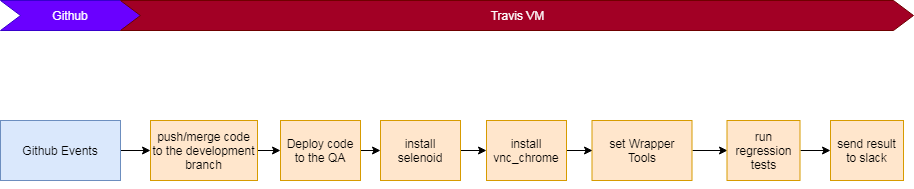

## Automation Tests Workflow

## Automation Tests configuation

We can configure these environment variables in the Travis configuration file:

- REG_TEST_DIR this is configuration about the directory of automation tests
- REG_TEST_GROUP configure which group would be ran in the automation tests

The file scripts/run_regression.sh is the main script file to run the automation tests. It's bash shell scirpt, We can change this script file according to our needs.

for example, if we want send message to the other slack room, we just change this code

``curl -i -X POST -H "'Content-type':'application/json'" -d "{'attachments':[{'title':'Regression Tests Failed on CommitID ${TRAVIS_COMMIT} <${TRAVIS_JOB_WEB_URL} | detail>', 'color':'danger'}]}" https://hooks.slack.com/services/``

## close the automation tests
remove this line from the .travis.yml

`` - bash tests/regression/scripts/run_regression.sh``

## how to run the automation tests in local
- please git clone the Popsugar/web repos in your local
- go to Popsugar/web:test/codeception/qaTools directory
- run ``php install.php`` (install the Wrapper tool in your local). more detail please see the [Wiki](https://sites.google.com/a/popsugar.com/engineering-wiki/qa/ui_automation)
- run command ``devQAWrapper``, if you see the command help, it means the wrapper tool have installed in your machine, then you can go to next step
- go back to your sparkle-web directory
- run command ``devQAWrapper -R -e dev4chromeEnv -c ./tests/regression/codeception --detail_fail_cases -p 4 --clear_data --detail_fail_cases -g sparkle-web``, you would see the browser will open, and the running steps will show on the screen